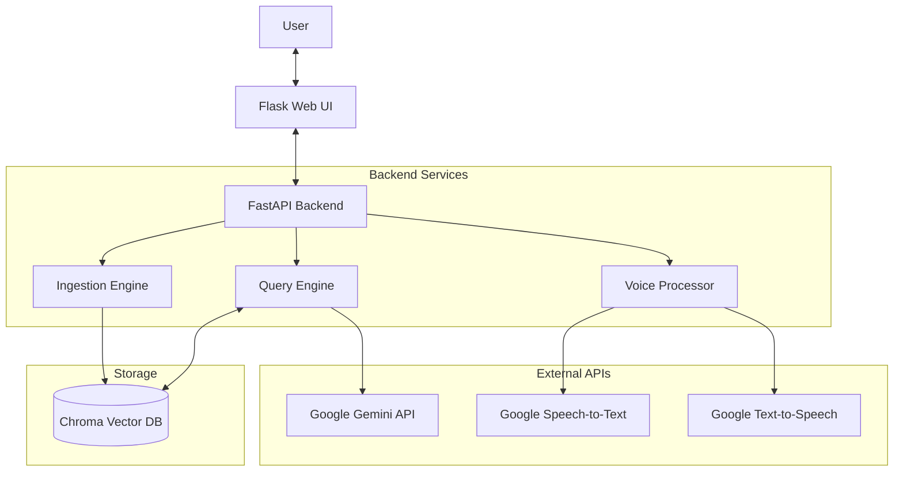
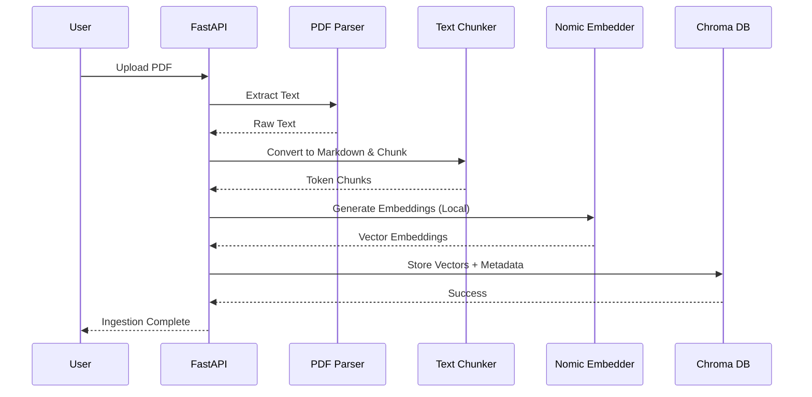
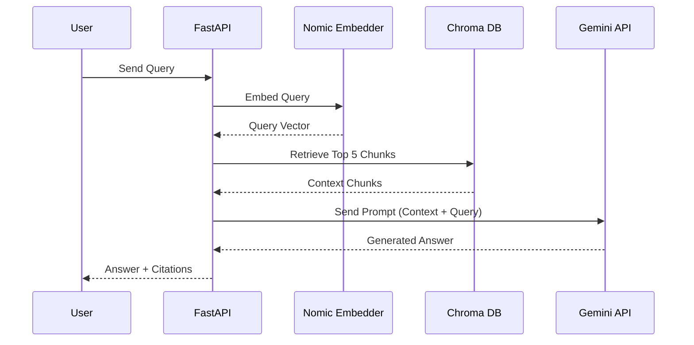
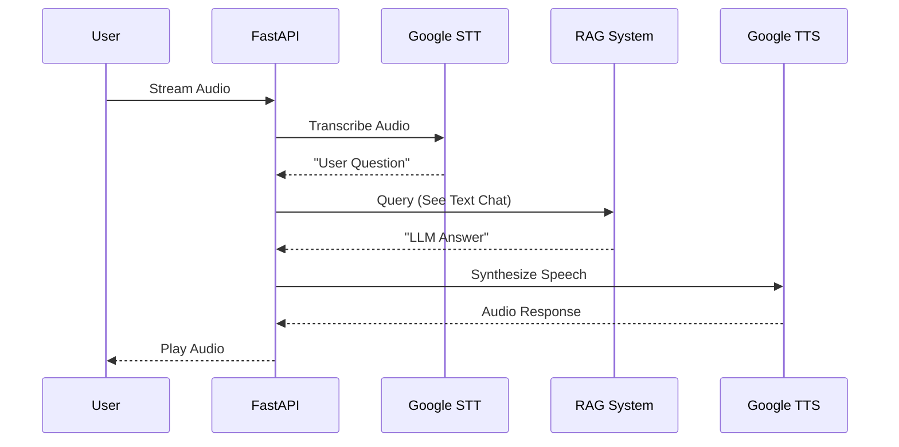

# Local RAG Chatbot

A local-first Retrieval-Augmented Generation (RAG) system that ingests PDFs, embeds chunks locally with `nomic-embed-text-v1`, stores them in a local Chroma vector database, and answers user queries by retrieving relevant chunks and sending only those to Google Gemini for final response generation.

## 🎯 Key Features

- **Local-first**: All document text and embeddings stay on your machine during ingestion
- **PDF ingestion**: PyMuPDF-based PDF parsing with Markdown conversion
- **Batch Upload**: Upload multiple PDFs simultaneously for efficient processing
- **Local embeddings**: nomic-embed-text-v1 (CPU/GPU support)
- **Vector storage**: Chroma DB with duckdb+parquet persistence
- **Cloud LLM**: Google Gemini for answer generation (only retrieved chunks are sent)
- **Direct Answers**: Conversational responses without inline citations (temperature: -0.5)
- **Voice Interaction**: Speech-to-text and text-to-speech for natural conversations
- **API + UI**: FastAPI backend with Flask web interface

## 📋 Architecture

### 1. System Overview

High-level view of how the Frontend, Backend, Storage, and External Services interact.



### 2. Ingestion Pipeline

How documents are processed from PDF to Vector Database.



### 3. Text Chat Flow

How a text query is answered using RAG.



### 4. Voice Interaction Flow

The real-time voice conversation loop.



## 🔧 Prerequisites

- Python 3.9 or higher
- Google Gemini API key ([Get one here](https://makersuite.google.com/app/apikey))
- ~500MB disk space for embedding model
- **FFmpeg** (required for voice features - audio format conversion)
- Optional: CUDA-capable GPU for faster embeddings

### Installing FFmpeg

**Windows:**
```powershell
# Using Chocolatey
choco install ffmpeg

# Or download from https://ffmpeg.org/download.html
# Add ffmpeg to PATH
```

**macOS:**
```bash
brew install ffmpeg
```

**Linux (Ubuntu/Debian):**
```bash
sudo apt update
sudo apt install ffmpeg
```

**Verify installation:**
```bash
ffmpeg -version
```

## 📦 Installation

### 1. Clone or download this repository

```bash
cd Rag-chatbot
```

### 2. Create virtual environment (recommended)

```bash
python -m venv venv

# Windows (PowerShell)
venv\Scripts\Activate.ps1

# macOS/Linux
source venv/bin/activate
```

### 3. Install dependencies

```bash
pip install -r requirements.txt
```

This will install:

- FastAPI & Uvicorn (API server)
- PyMuPDF (PDF parsing)
- sentence-transformers (embeddings)
- ChromaDB (vector database)
- google-generativeai (Gemini LLM)
- Flask & Flask-CORS (Web UI)
- SpeechRecognition (Speech-to-Text)
- gTTS & pyttsx3 (Text-to-Speech)
- pytest (testing)

### 4. Download the embedding model

**Option 1: Download to default cache (recommended)**

```bash
python download_model.py
```

**Option 2: Download to custom ./models/ directory**

```bash
python download_model.py --custom-path
```

This will download the `nomic-embed-text-v1` model (~100-500MB). The model is required before running the application.

## ⚙️ Configuration

### 1. Set up environment variables

Copy the example env file:

```bash
# Windows (PowerShell)
Copy-Item .env.example .env

# macOS/Linux
cp .env.example .env
```

### 2. Edit `.env` file

```bash
# Required: Your Google Gemini API key
GOOGLE_API_KEY=your_actual_api_key_here

# Optional: Custom paths (only if you used --custom-path for model download)
CHROMA_PERSIST_DIR=./chroma_data
EMBEDDING_MODEL_PATH=./models/nomic-embed-text-v1
```

**Note:** If you downloaded the model to the default cache (without `--custom-path`), you don't need to set `EMBEDDING_MODEL_PATH`.

### 3. Model Download

**The model is now pre-downloaded** using the `download_model.py` script in step 4 of Installation.

If you need to download manually for air-gapped environments:

1. On a machine with internet, run: `python download_model.py --custom-path`
2. Copy the entire `./models/nomic-embed-text-v1/` directory to your air-gapped machine
3. Set `EMBEDDING_MODEL_PATH=./models/nomic-embed-text-v1` in `.env`

## 🚀 Running the Application

### Start the FastAPI backend

```bash
# From project root
python -m uvicorn backend.app:app --reload
```

API will be available at: `http://localhost:8000`

- API docs (Swagger): `http://localhost:8000/docs`
- Health check: `http://localhost:8000/health`

### Start the Flask UI (in separate terminal)

```bash
# Activate venv first, then:
python ui_flask/app.py
```

UI will open in browser at: `http://localhost:5000`

- Home page: `http://localhost:5000`
- Chat interface: `http://localhost:5000/chat`
- Voice chat: `http://localhost:5000/voice`
- Upload documents: `http://localhost:5000/upload`
- Document library: `http://localhost:5000/documents`

### HTTPS Configuration (Required for Voice Features)

Voice features require HTTPS because browsers block microphone access on insecure (HTTP) connections, unless you are using `localhost`.

**For Remote Access:**
If you want to access the voice features from another device on your network, you must enable HTTPS. You can do this by setting `HTTPS_ENABLED=true` in your `.env` file. The application will generate a self-signed certificate for you.

## 💡 Using the Application

### Text-based Chat

1. **Upload PDFs**: Navigate to "Upload" page and select one or multiple PDF files
2. **Wait for processing**: The system will parse, chunk, and embed your documents
3. **Ask questions**: Go to "Chat" page and type your questions
4. **Review answers**: Get direct conversational answers with citations
5. **View context**: Expand "Retrieved Context Chunks" to see source passages

### Voice Interaction

The Voice Chat page provides a **real-time voice-only conversation experience** with natural speech interaction:

**Voice Conversation Flow:**

1. Navigate to "Voice Chat" page (`http://localhost:5000/voice`)
2. Click the large circular microphone button to start recording
3. Speak your question naturally (status shows "Listening...")
4. Click the stop button when finished speaking
5. AI processes your question (status shows "Processing...")
6. Listen to the AI's voice response (status shows "AI is speaking...")
7. Review conversation history with audio playback controls
8. Click microphone again to ask another question

**Key Features:**

- **Voice-Only Interface**: Pure voice interaction without text alternatives
- **Real-Time Processing**: Immediate transcription and response generation
- **RAG Integration**: Voice queries access your uploaded documents
- **Natural Conversation**: Speak naturally, AI responds with synthesized voice
- **Conversation History**: All interactions saved with audio playback
- **Status Indicators**: Visual feedback for listening/processing/speaking states
- **Browser-Based**: No app installation required, uses Web Audio API

**Technical Details:**

- **Speech-to-Text**: Google Speech Recognition (cloud)
- **Text-to-Speech**: gTTS natural voice synthesis (cloud)
- **Audio Format**: WebM/Opus input, MP3 output
- **Recording Features**: Echo cancellation, noise suppression, auto gain control

**Browser Requirements:**

- Modern browser: Chrome 70+, Firefox 65+, Edge 79+, Safari 14.1+
- HTTPS required (localhost OK for development)
- Microphone permission must be granted
- MediaRecorder API support

**Privacy Note:**

Voice data is processed through Google services (Speech Recognition, TTS, Gemini LLM). Audio is not stored permanently. For maximum privacy, use text chat instead.

### Batch Upload

1. Go to "Upload" page
2. Drag and drop multiple PDF files or click "Browse Files"
3. Wait for parallel processing
4. View individual results for each document

## 📚 API Documentation

Full API documentation is available via the interactive Swagger UI:

- **URL**: `http://localhost:8000/docs`

## 🧪 Testing

Run the test suite:

```bash
# Run all tests
pytest backend/tests/ -v

# Run specific test file
pytest backend/tests/test_embedder.py -v

# Run with coverage
pytest backend/tests/ --cov=backend --cov-report=html
```

**Current test coverage:**
- ✅ Embedder: encoding, normalization, consistency
- ✅ Chunker: token-based splitting, overlap validation
- ✅ Markdown converter: heading/list preservation
- ✅ Chroma DB: CRUD operations
- ⚠️ Integration tests: Require sample PDFs and gold Q/A data

## 🔒 Security & Privacy

### What stays local:
- ✅ All PDF content during ingestion
- ✅ All embeddings (never sent to cloud)
- ✅ Vector database (stored in `./chroma_data`)

### What is sent to cloud:
- ⚠️ **Only the top 5 retrieved chunks** + user query sent to Gemini
- ⚠️ API key transmitted via HTTPS

### Recommendations:
- Use `.env` file for API keys (never commit to git)
- Enable disk encryption for sensitive data
- Review retrieved chunks before querying if needed
- Redact sensitive information before uploading PDFs

## ⚠️ Limitations

1. **No OCR support**: Image-only or scanned PDFs will fail. Text-based PDFs only.
2. **No streaming**: Responses are non-streaming.
3. **Single-user**: No authentication or multi-tenancy.
4. **English-focused**: `bert-base-uncased` tokenizer optimized for English.
5. **Fixed retrieval**: Always retrieves top 5 chunks (no hybrid search/reranking).

## 📊 Performance

- **Ingestion**: ~1 PDF (10 pages) per minute (CPU-only)
- **Retrieval**: <200ms for local embedding + vector search
- **Total query latency**: <2s retrieval + Gemini API time


## 🛠️ Troubleshooting

### "Cannot connect to API server" or "Backend connection issue"
- Ensure FastAPI is running: `python -m uvicorn backend.app:app --reload`
- Check if port 8000 is available
- Verify `BACKEND_URL` environment variable (default: http://localhost:8000)
- Check Flask terminal for error messages

### "GOOGLE_API_KEY not set"
- Create `.env` file from `.env.example`
- Add your actual API key to `.env`
- Restart FastAPI server

### "Model download failed"
- Check internet connection
- For air-gapped setup, manually download model (see Configuration section)
- Ensure ~500MB free disk space

### "Failed to extract page X: image-only"
- Page contains only images (OCR not supported)
- Convert to text-based PDF or extract text manually

### Slow embeddings
- Install CUDA-compatible PyTorch for GPU acceleration
- Reduce batch size if running out of memory
- Consider using a machine with more RAM/VRAM

### Flask UI not loading or 404 errors

- Verify Flask is running: `python ui_flask/app.py`
- Check if port 5000 is available
- Clear browser cache and reload
- Check Flask terminal for errors
- Ensure all static files exist in `ui_flask/static/`

### Voice recording not working

- Grant microphone permission in browser
- Use HTTPS or localhost (required for Web Audio API)
- Try a different browser (Chrome recommended)
- Check browser console for errors (F12)

### "Audio file could not be read" or voice transcription fails

**Problem:** Backend logs show "Audio file could not be read..."

**Solution:** Ensure FFmpeg is installed and in your system PATH. See the **Prerequisites** section above for installation instructions.

### "Voice features not supported" or Protocol Errors

**Problem:** Browser shows "Voice features not supported in this browser" or Flask logs show TLS/SSL errors with garbled binary data.

**Root Cause:** 
- Browser blocks microphone access on HTTP connections from non-localhost addresses
- Client attempting HTTPS connection to HTTP-only server
- Mixed content security policy violations

**Solutions:**

1. **For localhost development:** Access via `http://localhost:5000` or `http://127.0.0.1:5000` (works with HTTP)

2. **For remote/LAN access (e.g., `http://192.168.x.x:5000`):**
   - Enable HTTPS with `HTTPS_ENABLED=true` environment variable
   - Use reverse proxy with SSL termination (nginx recommended)
   - Access via `https://` URL instead of `http://`

3. **For TLS handshake errors in logs:**
   - Ensure clients use `http://` URLs if server runs HTTP-only
   - Or enable HTTPS support (see "HTTPS Configuration" section above)
   - Check browser isn't auto-upgrading HTTP to HTTPS (clear HSTS cache)

4. **Backend connection issues:**
   - Verify backend is running: `python -m uvicorn backend.app:app --reload`
   - Check CORS settings if using custom domains
   - Ensure `ALLOWED_ORIGINS` environment variable includes your frontend URL

## 🔄 Development

### Adding new tests

```bash
# Create test file in backend/tests/
# test_*.py

# Run specific test
pytest backend/tests/test_your_feature.py -v
```

### Modifying chunk size or overlap

Edit `backend/ingest.py`:

```python
self.chunker = TextChunker(
    chunk_size=400,  # Change this
    overlap=50       # Change this
)
```

### Using different tokenizer

Edit `backend/ingest.py`:

```python
self.chunker = TextChunker(
    tokenizer_name="your-tokenizer-name"
)
```

## 📝 License

[MIT License](LICENSE)
